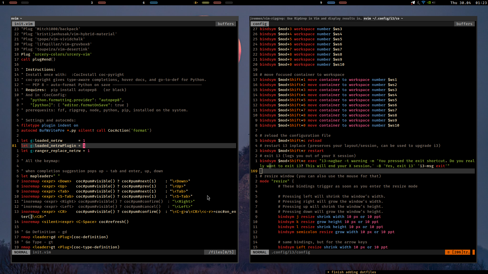

# nvim_config
-------------

nvim setted for editing files at home
theme is beautiful [srcery](https://github.com/srcery-colors/srcery-vim)

### requirements:
linux (for ranger)
nvim 0.11
npm
python
fzf, ripgrep, fd-find
ctags-universal (for tagbar)

### Installation:
put contents into ~/.config/nvim/

### Technical Choise:
Plug (as simple as that)
simple single .vim file, with rare lua piecies
Coc, FZF, airline, ranger 

hotkeys how i like it. try to keep it fast to reach but semantic enough to not forget

setted to work with python a nd web
